# 🍽️ Restaurant Website

This is a full-stack web application for "Restaurant," featuring a menu, online ordering, user profiles, and admin management, all designed with a stunning, responsive layout using Bootstrap.

---

## 🍽️ About Restaurant Website

Welcome to the **Restaurant Website**, a modern, responsive web app that allows customers to browse the menu, place orders,  and manage their profiles. It also provides restaurant staff with an admin dashboard to manage menu items, orders, and user accounts, all wrapped in a great design powered by Bootstrap.

### 🛠️ Technologies & Libraries

- **Frontend:**
  - React.js (CRA)
  - Bootstrap 5 for layout, components, and responsive design
- **Backend:**
  - Node.js + Express.js
  - MongoDB with Mongoose ORM
- **Tooling & Scripts:**
  - `npm run start-all` to install dependencies, seed the database, and launch both frontend (3000) and backend (5000)
  - Environment variables managed via `backend/.env`

### 📄 Pages & Features

| Page / Section | Description |
| --- | --- |
| **Home** | Hero banner with restaurant imagery, featured dishes, and call-to-action buttons like “View Menu” or “Order Now.” |
| **Menu** | Displays the restaurant’s offerings with categories (e.g., Appetizers, Main Courses, Desserts), item descriptions, prices, and images. |
| **About** | Information about Restaurant’s history, chefs, and unique selling points. |
| **Reviews** | Customer testimonials and ratings, with an option for users to leave reviews. |
| **Profile** | User sign-in, profile management, and order history. |
| **Checkout** | Step-by-step process for reviewing the order, entering delivery details, and simulating payment. |
| **Admin Dashboard** | Protected area where staff can: |

1. **Manage** menu categories and items (CRUD)
2. **View/Edit** orders and update statuses
3. **Manage** user accounts
4. **Edit** general site information (e.g., contact details, hours) |

### 🔑 Admin Credentials

> **Email:** `admin@admin.com`\
****Password:** `admin123`

> *(Access the admin dashboard at http://localhost:3000/admin)*

---

## 📋 Prerequisites

Ensure you have the following installed:

### 1. Node.js & npm

- **Download:** Node.js Official Website (LTS version recommended)
- **Verify Installation:**

```bash
$ node -v
$ npm -v
```

### 2. MongoDB

- **Download:** MongoDB Community Server
- **Installation Guides:**
  - Windows: Install on Windows
  - Linux: Install on Linux
- **Start MongoDB:**

Windows (PowerShell; if installed as a service, it may already be running)

```powershell
PS> net start MongoDB
```

Linux

```bash
$ sudo systemctl start mongod
```

- **Verify the Mongo Shell:**

```bash
$ mongosh
# (type `exit` then Enter to quit)
```

---

## 🚀 How to Get Started

### 1. Clone the Repository

Open your terminal (preferably in VS Code) and run:

- Windows (PowerShell)

```bash
# Replace with your preferred directory
PS> cd C:\Users\YourUser\Documents\Projects
PS> git clone https://github.com/MIbrahimPro/Simple-Hair-Salon-Website-using-Mern.git
```

- Linux/macOS

```bash
# Replace with your preferred directory
$ cd ~/Projects
$ git clone https://github.com/MIbrahimPro/Simple-Hair-Salon-Website-using-Mern.git
```

### 2. Navigate to the Project Folder

Windows (PowerShell)

```bash
PS> cd Simple-Hair-Salon-Website-using-Mern
```

Linux/macOS

```bash
$ cd Simple-Hair-Salon-Website-using-Mern
```

### 3. Start the Application

From the project root, run:

```bash
$ npm run start-all
```

This script will:

1. Check/create `backend/.env` with default settings
2. Install all dependencies (frontend + backend)
3. Seed the database with initial data (menu items, categories, admin user)
4. Launch the backend (http://localhost:5000) and frontend (http://localhost:3000)

- **Frontend:** http://localhost:3000
- **Backend API:** http://localhost:5000

To stop the servers, press **Ctrl + C** (you may need to press it twice).

---

## 📸 Screenshots

\*h3&gt;Home Page

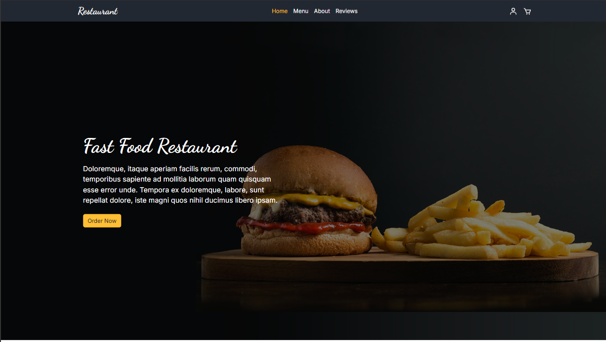

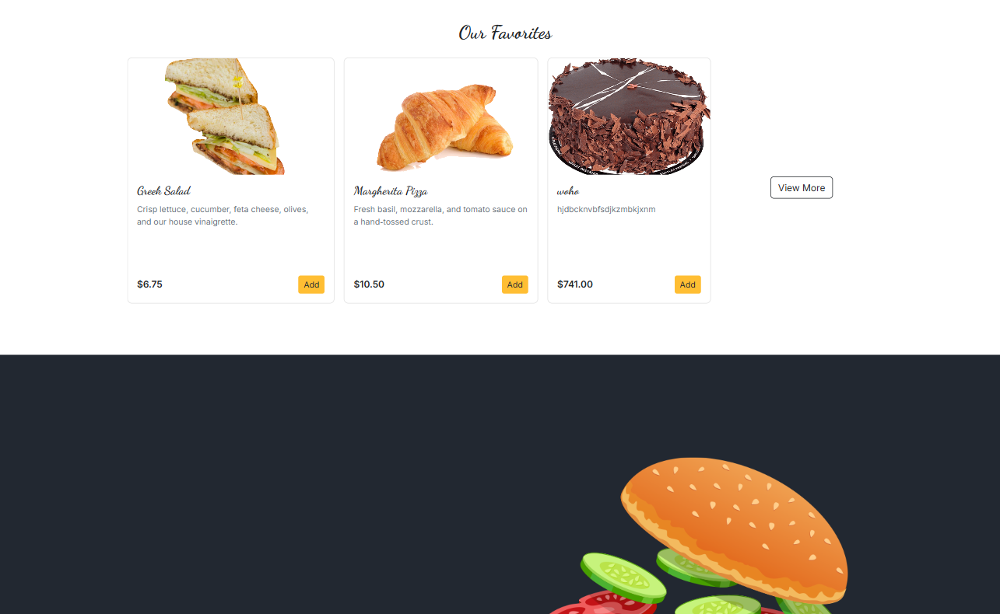

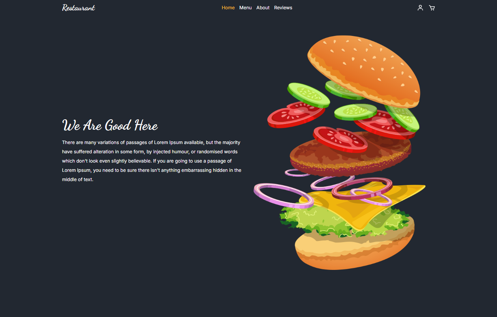

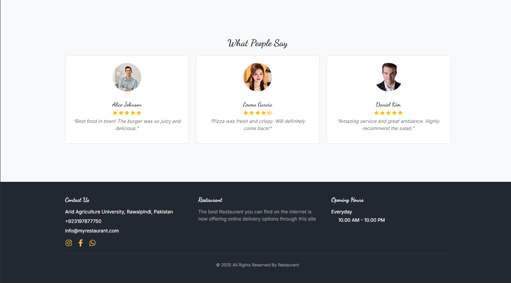

### Menu Page

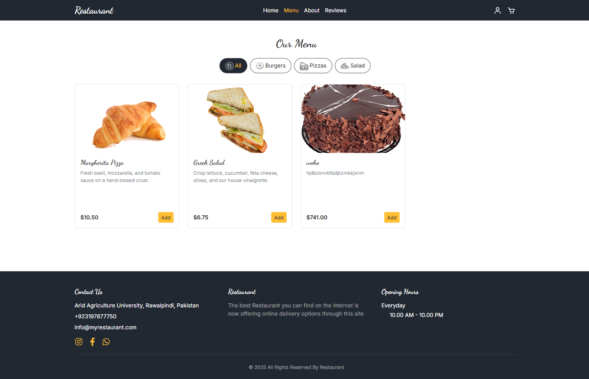

### Checkout Page

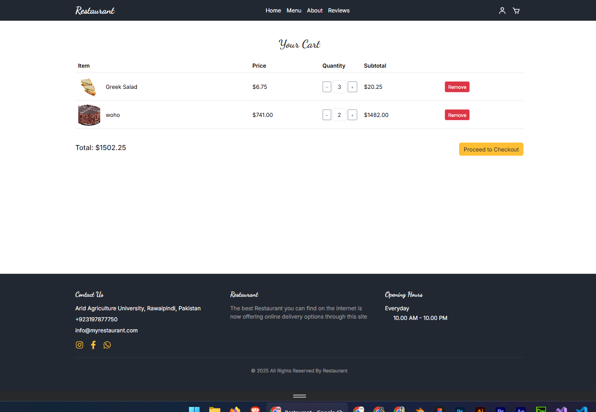

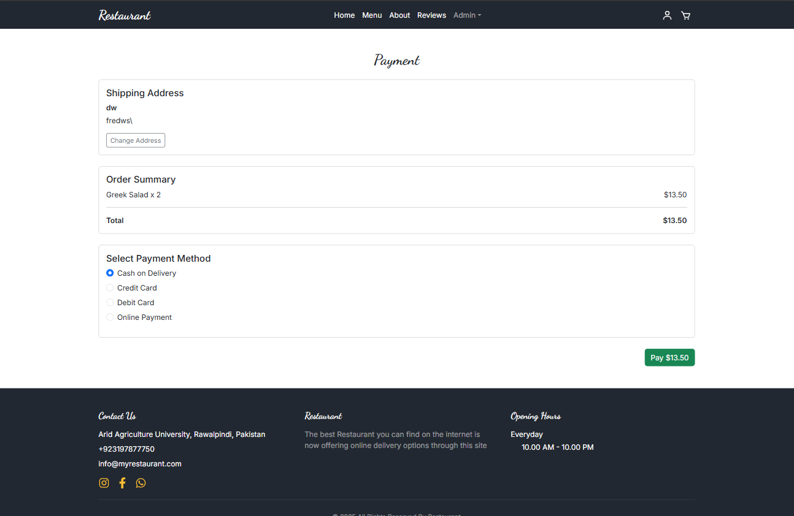

### Profile Page

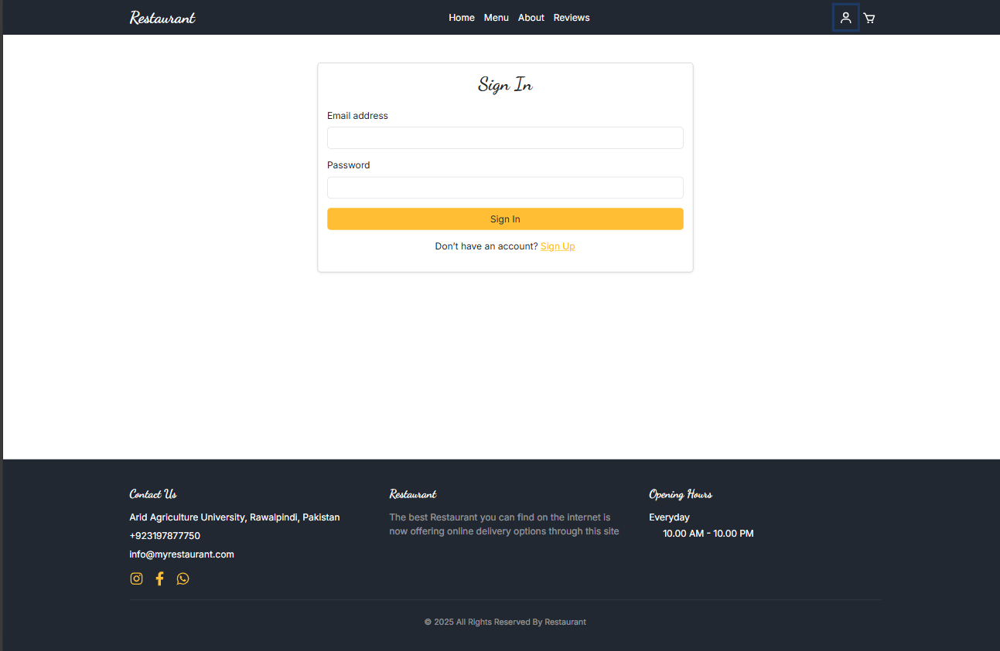

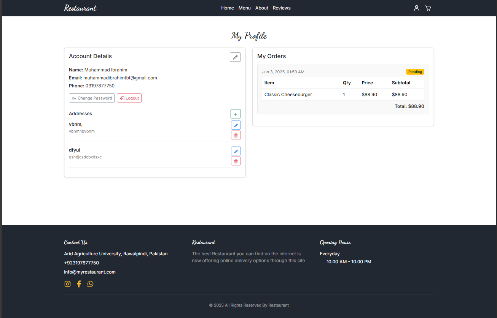

### Review Page

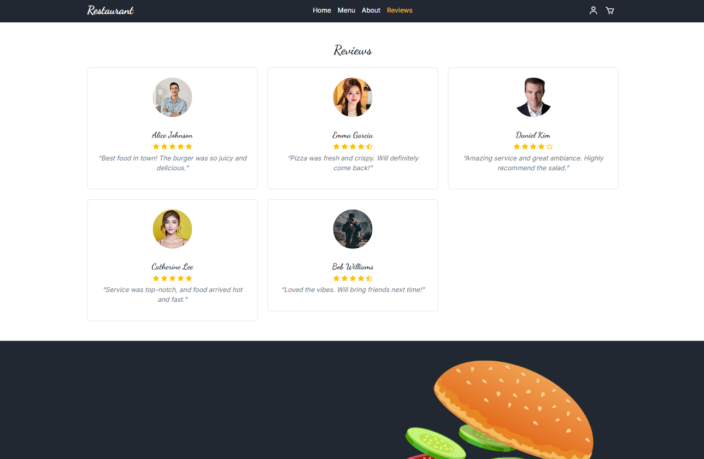

### Admin Pages

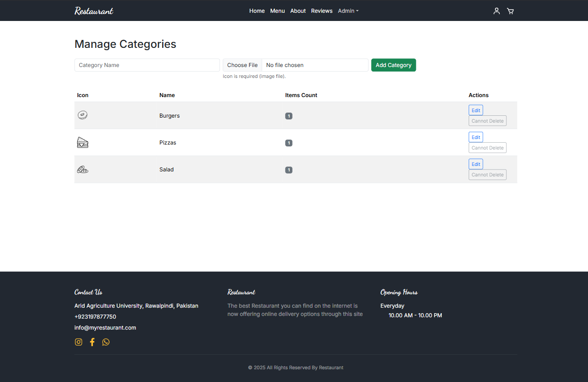

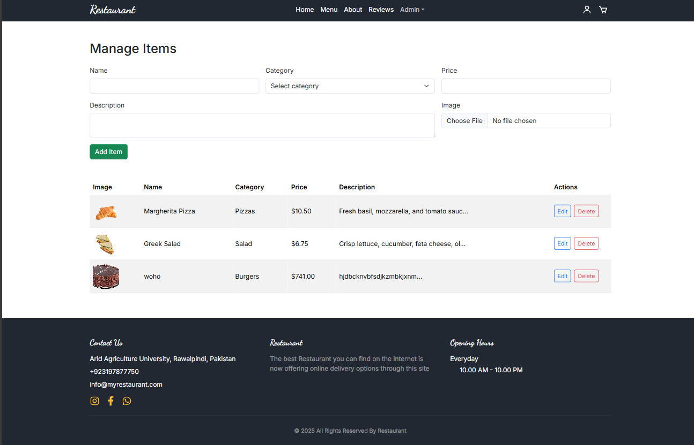

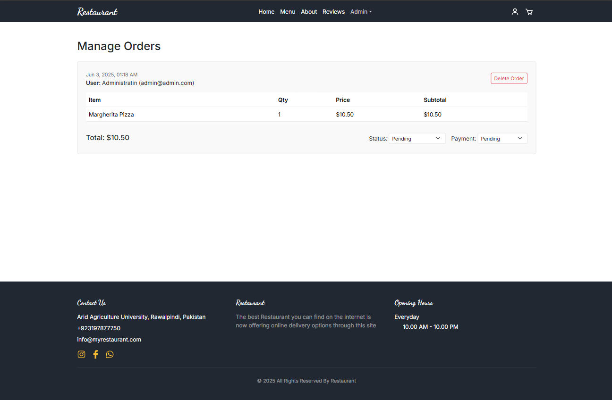

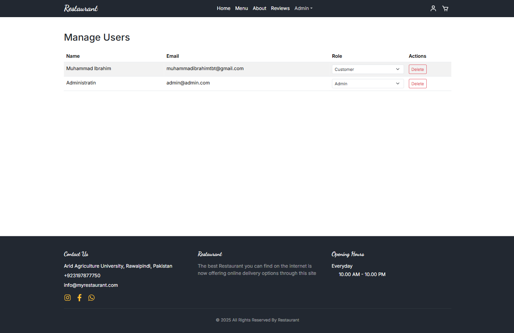

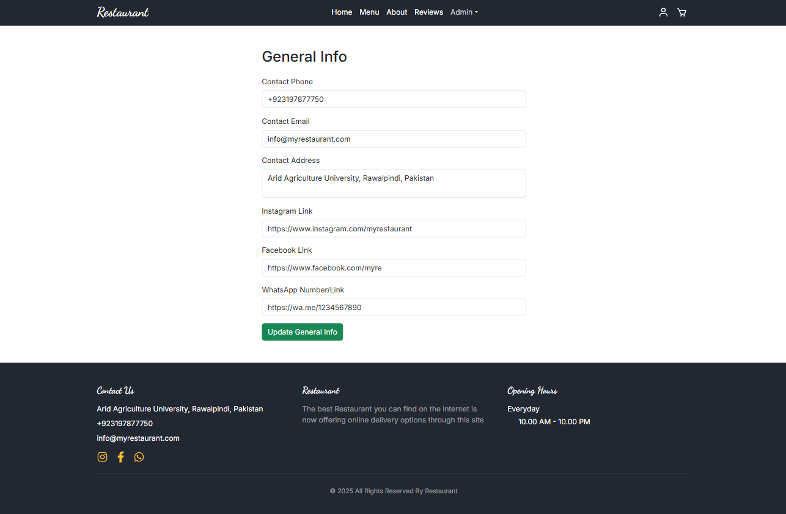

---

## 🎨 Customization Tips

- **Design:** Leverage Bootstrap 5 for a sleek, responsive layout with a warm, inviting color scheme tailored to Restaurant’s branding.
- **Images:** Use high-quality visuals of dishes and the restaurant interior to enhance the user experience.
- **Features:** Extend functionality with reservations, loyalty programs, Dynamic Review system, or integration with a payment gateway like Stripe.

Enjoy building Restaurant’s online presence!